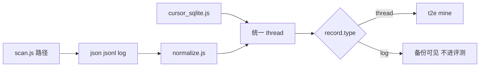

# 新平台会话四类数据改进

每一步先固定目标、边界和风险，再改代码。不碰导入回写（[core/import.js](core/import.js) 继续只服务已有 Cursor / Claude / Codex 等），避免把猜测格式写进用户的 IDE 目录。

## 阶段 0：平台目录单点

- 目标：macOS / Linux / Windows 的 CodeBuddy、CodeBuddy CN、WorkBuddy、WorkBuddy CN、ZCode、Trae、Trae CN、Trae Work、Trae Work CN 目录只维护一处，扫描和 vscdb 共用。
- 边界：只增加候选路径。不删除现有 Cursor / Claude / Codex 路径，不改扫描深度和 glob 忽略规则。
- 风险：Windows 路径写错会多扫空目录（已有 `pathExists` 跳过，可接受）；扫到无关 JSON 会被现有 `isInterestingFile` 挡住。
- 做法：在 [core/utils.js](core/utils.js) 增加 `IDE_HOME_REL_PATHS`（按 `os.platform()` 展开 `~/Library/Application Support`、`~/.config`、`%APPDATA%`）。[core/scan.js](core/scan.js) 的 `PATH_PATTERNS` 与 [core/cursor_sqlite.js](core/cursor_sqlite.js) 的 `getVscdbWorkspaceRootCandidates()` 改为引用它。补上脚本里的 `.traework`，并保留已有 `.trae-work`。Linux XDG 补上 CN 变体。Windows vscdb 列表补上这五个产品（当前 [core/cursor_sqlite.js](core/cursor_sqlite.js) 第 118–129 行只有 Cursor / Code / Windsurf / Antigravity）。

## 阶段 1：来源 ID

- 目标：Trae Work 与 Trae 分开；WorkBuddy 不会被 CodeBuddy 吃掉；ZCode 不会被通用 `/code/` 吃掉。
- 边界：`trae` 仍是 Trae / Trae CN。只有路径含 `trae work`、`trae-work`、`traework` 才标 `traework`。规则必须写在 `"trae"` 之前（[core/utils.js](core/utils.js) `TOOL_RULES`、[core/cursor_sqlite.js](core/cursor_sqlite.js) `inferSourceFromVscdbPath`）。
- 风险：已有备份里 Trae Work 文件的 `meta.source` 会从 `trae` 变成 `traework`，统计筛选会分开。这是预期行为，不改历史文件。
- 做法：把 `traework` 加入 [core/normalize.js](core/normalize.js) `ALLOWED_SOURCES` 和别名。校验器枚举来自该集合，会自动跟上。`TOOL_DOMAIN_MAP` 已有 `traework`，不必改评测域。

## 阶段 2：session / trace

- 目标：一个文件里若有稳定会话 ID，拆成多条 thread，而不是整文件一个 `thread_id`。
- 边界：只认已有字段：`sessionId`、`session_id`、`trace_id`、`conversations[]`、`sessions[]`。没有这些字段时，`thread_id` 仍是路径哈希（[core/normalize.js](core/normalize.js) `makeId`），现有单文件会话 ID 不变。
- 风险：拆分后同一路径会变成多条记录，导出条数上升。用 `meta.file_path` + `meta.extra.session_id` 保留回溯。不把 trace 事件流误当成 chat。
- 做法：`normalizeItem` 在 `extractContent` 之后，若结果带 `sessions[]`，每条会话单独 `buildRecord`。`thread_id` = sha1(路径 + session id)。

## 阶段 3：chatlog

- 目标：多轮对话保持 user / assistant / system，数组或对象形式的 `content` 收成字符串（schema 要求 `content` 为 string，见 [core/schema-validator.js](core/schema-validator.js)）。
- 边界：不新增厂商专有 schema 名。沿用并收紧现有分支：`messages[]`、`conversation` / `history`、JSONL 的 `message.role`。文本块从 `text` / `content` / `rawText` 取。空内容的行丢弃并写入 `meta.warnings`，不把整文件 fallback 成一条 assistant（该 fallback 只留给 Markdown）。
- 风险：收紧 fallback 可能让以前被整文件吞进去的杂项 JSON 变成 0 条。这些本来 `recognition_confidence` 就是 low，丢掉比污染 chatlog 更安全。Cursor tabs / composer 分支保持原样，先匹配再走通用逻辑。
- 做法：抽一个 `contentToString` 供 [core/normalize.js](core/normalize.js) 与 [core/cursor_sqlite.js](core/cursor_sqlite.js) `extractMessages` 共用，避免两套解析漂移。vscdb 命中通用消息时，`recognition_confidence` 维持现有逻辑；键名不在 `EXACT_KEYS` 里时改为 `low`，避免 `%chat%` 误命中被标成 high。

## 阶段 4：tool use

- 目标：工具调用和结果进入同一条 thread 的 `messages`，角色用 `assistant`（调用）和 `user`（结果）以外的稳定标记：`content` 仍是可读文本，`message.meta.kind` 为 `tool_use` 或 `tool_result`，`message.meta.name` 为工具名。
- 边界：只处理已经出现在 JSONL / 消息块里的形态：`type: tool_use | tool_result | function_call | function_call_output`，以及 `content[]` 里的 `{ type: "tool_use" }`。不扩大 vscdb 的 `LIKE` 模式（扩大会把设置项扫进来）。
- 风险：T2E 的 [core/t2e/mine.js](core/t2e/mine.js) 用正则在正文里找 tool call。结构化字段写入正文前缀（沿用现有 `[Tool Use]`）即可被挖到，不必改挖掘正则。不要把工具参数里的密钥单独复制到新字段。
- 做法：JSONL 里已有的 tool 分支保留。补上「一条 message 的 content 是块数组」时把 tool_use / tool_result 拆成相邻消息。SQLite 的 `messages[]` 同样走 `contentToString`，块数组不再被 `JSON.stringify` 成一大团。

## 阶段 5：运行日志

- 目标：运行日志单独成记录，不进入评测挖掘。
- 边界：仅当路径含 `run`/`log` 且正文是事件行（`trace_id`、`agent_start`、`agent_end`、`event`）而不是 chat `messages` 时，`type` 设为 `log`。已有 chat 形状优先当 thread。
- 风险：schema 的 `type` 枚举目前没有 `log`。只在 [core/schema-validator.js](core/schema-validator.js) 增加这一项。`mineEpisodes` 已只处理 `type === "thread"`，日志不会进 episode。UI 若按枚举过滤，未知 type 会被漏掉，因此服务端列表不要按旧枚举丢弃 `log`。
- 做法：日志消息 `role: "system"`，一行一个事件的文本；`meta.extra.kind = "runtime_log"`。不把日志并进同目录的 chat thread。

## 阶段 6：T2E 扫描对齐

- 目标：不用备份、走实时扫描时，vscdb 会话和文件扫描结果一起进入 pipeline。
- 边界：只改 [src/server/t2e-routes.js](src/server/t2e-routes.js) `runPipelineAsync` 里 `useBackup === false` 的分支，与 [src/commands/scan.js](src/commands/scan.js) 一样调用 `collectAllVscdbRecords()`。默认 `useBackup !== false` 的路径不动。
- 风险：实时扫描变慢（多读 SQLite）。只读打开，失败的库已在 `readCursorSqlite` 里吞掉。合并时按 `thread_id` 去重。

## 阶段 7：测试与文档

- 目标：用合成 fixture 锁定四类行为，不依赖本机是否安装这些 IDE。
- 边界：不提交真实聊天记录。fixture 放在 `tests/fixtures/`，覆盖：Trae Work 路径 → `traework`；一个 JSON 两个 `sessionId` → 两条 thread；content 块里的 tool_use；运行日志 → `type: log` 且 `mineEpisodes` 跳过。
- 风险：fixture 形状是「我们声明支持的子集」，不是厂商格式的完整证明。README 支持表改成：目录发现为已覆盖；会话解析为「通用 chat / tool / log」，并写明未用真实安装包核对。
- 导入回写、猜测原生键名、放宽 SQLite `LIKE`，这三项明确不做。
