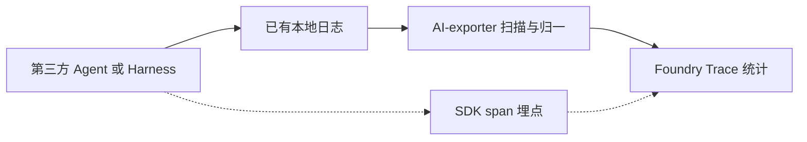

# Foundry 无埋点监听是否可行

结论：可以作为通用统计组件，但只能监听**已经落盘的日志**，不能监听只存在于进程内存里的第三方 harness。和 AI-exporter 协同是对的，分工应是「exporter 只读采集，Foundry 只做统计」，不要把 Foundry SDK 的 `span()` 当成这条路的入口。

## 现在三条路分别是什么

- SDK 埋点：[packages/foundry/README.md](file:///Users/zhyr/work/Foundry/packages/foundry/README.md) 的 `foundry.trace` / `t.span('LLM'|'TOOL')` 必须改对方代码。这和「不埋点」相反。SDK 文档也写明它是控制面（Prompt / Skill / feedback），不是全量日志管道。
- Forge 进程内转发：[docs/forge-write-event-wiring.md](file:///Users/zhyr/work/Foundry/docs/forge-write-event-wiring.md) 在 `write_events_batch` 之后调用 `foundry_bridge`，默认关闭。这是 Forge 自己的钩子，不是第三方通用监听。
- 只读文件：[docs/日志存储与导入原则.md](file:///Users/zhyr/work/Foundry/docs/日志存储与导入原则.md) 的 `watch:runlogs` 轮询 `traces/<id>/run_logs/`；AI-exporter 扫描 IDE 目录和 `state.vscdb`。这两条不改对方进程。

不埋点可行的只有第三条。前提是对方本来就会写文件。Cursor、Trae、CodeBuddy、WorkBuddy、ZCode 写的是 VS Code 系会话库或 JSON，不是 Forge 的 `agent_start` / `tool_id` 事件。内存态、加密库、只打到对方云端的 harness，不落盘就听不到。

## 统计能不能算准

Foundry 的 Tool / LLM / Agent 计数来自 [app/src/collector/aiExporterClosed.ts](file:///Users/zhyr/work/Foundry/app/src/collector/aiExporterClosed.ts) 的 `classifyRunLogEvent`：用事件名和 `payload.tool_id` 映射成 bash、function_call、llm、agent、turn。这是 Forge 方言，不是通用 schema。

AI-exporter 现在导出的是另一套形状：

- 会话：`type: thread`，`messages[]`，工具在 `message.meta.kind`，正文是 `[Tool Use]`。
- 运行日志：`type: log`，`meta.extra.kind = runtime_log`，一行一个 `trace_id` / `event`。
- 评测集不吃运行日志（`mineEpisodes` 只处理 `thread`）。

Foundry 接收导出目录的代码（[app/scripts/ingest-via-al-exporter.mts](file:///Users/zhyr/work/Foundry/app/scripts/ingest-via-al-exporter.mts)）只取前 8 条，每条一个 `CHAIN` span，把 JSON 截断当输出。Session、工具名、模型、耗时都进不了现有统计卡。所以「目录配上就能统计」目前不成立。

没有埋点时，统计上限等于日志里本来有的字段。对不上的包括：实时 token、模型名、成功或失败、工具参数是否完整。VS Code 系 `state.vscdb` 还要等写入后才能扫到，延迟是扫描周期，不是事件发生时刻。

## 和 AI-exporter 怎么协同

可行，而且应当保持现在的松耦合（[docs/日志存储与导入原则.md](file:///Users/zhyr/work/Foundry/docs/日志存储与导入原则.md) 原则三）：Foundry 运行时不 `import` `/Users/zhyr/work/Al-exporter`。

- AI-exporter：发现目录、把 chat / tool / runtime log 收成统一记录。它是采集器，不是仪表盘。
- Foundry：只消费这份记录，映射成已有 span（`AGENT` / `LLM` / `TOOL` / `CHAIN`），按 `session_id` 或 `trace_id` 聚合成一棵树。它是统计面。
- 实时：对已知目录做 `fs.watch` 或短周期轮询即可，不必在对方进程里埋点。AI-exporter 今天是批扫描；Foundry 的 watch 只覆盖 Forge `run_logs`。通用监听要补的是「同一套归一记录的增量订阅」，不是再做一个 SDK。

不要把统计逻辑写回 exporter，也不要让 Foundry 再维护一套 IDE 路径。路径和解析留在 exporter（或 Foundry 仓内那份封闭拷贝，升级时人工刷新）。Foundry 只认归一后的事件。

## 边界（做之前就固定）

- 不改第三方 Agent 源码，不默认打开 Forge `foundry_bridge`。
- 不扩大 SQLite `LIKE`，不猜测厂商私有键。统计只使用已经能抽出的 session、`tool_use` / `tool_result`、`runtime_log`。
- 运行日志继续不进评测集；进 Foundry 时标成 span，不标成训练样本。
- 导出目录接入要按 `thread_id` 去重，并映射工具 span；不能停在「前 8 条 CHAIN」。
- 对方没有落盘事件时，结论就是不可监听，而不是退回要求埋点。
