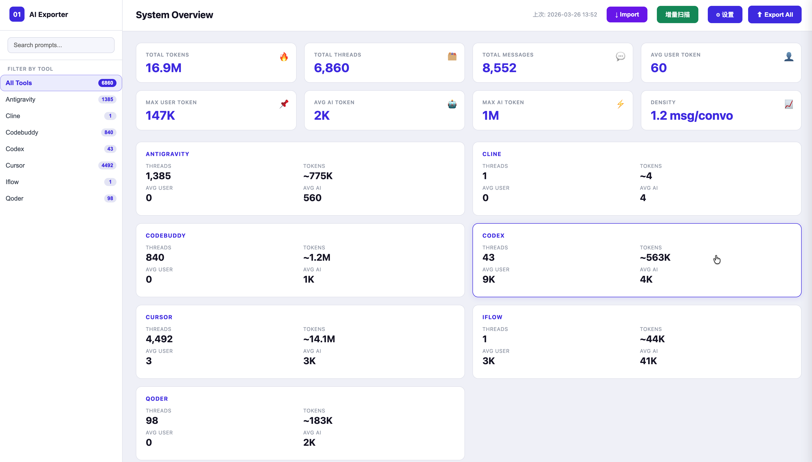
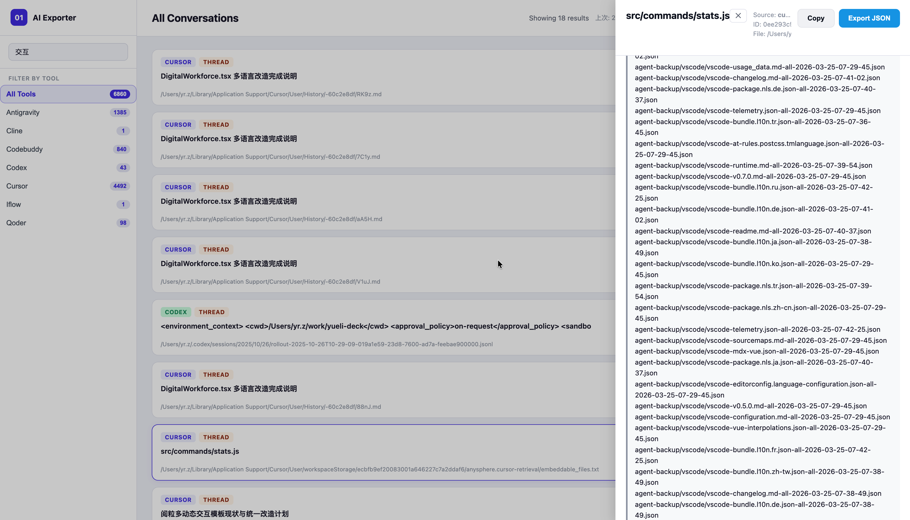
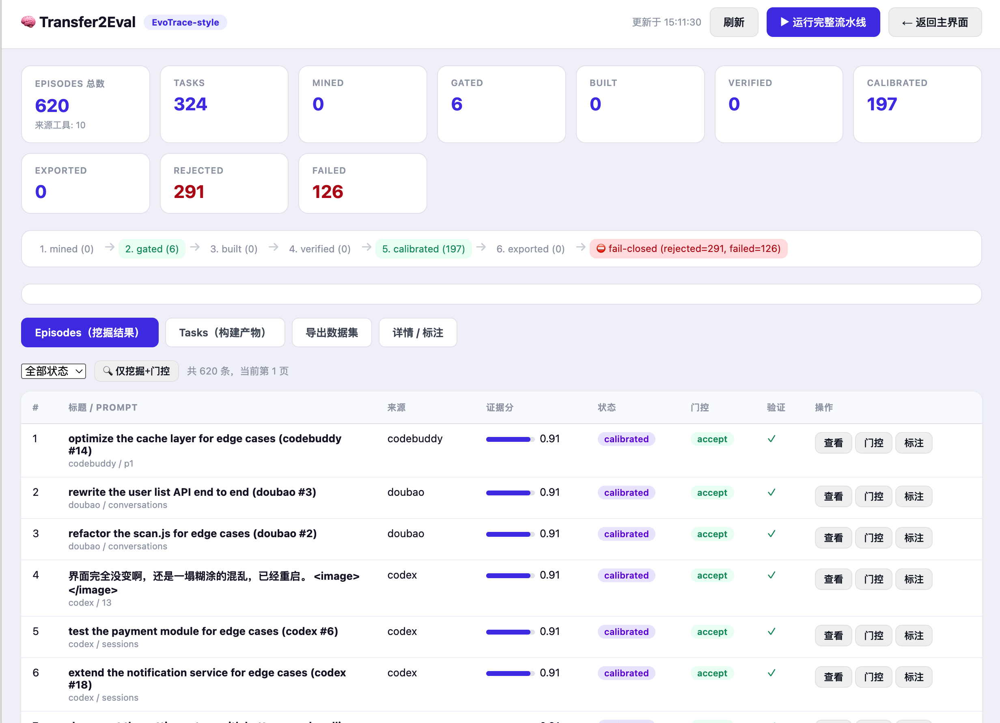
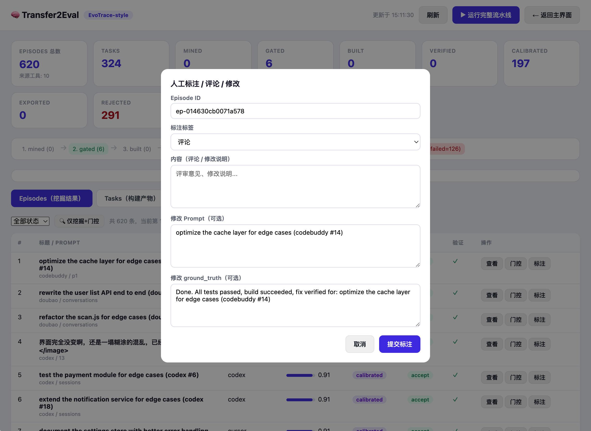

# AI Exporter

> 一键扫描、备份、导出 AI 编码工具对话数据，支持 26+ 主流 Agent，数据可转换为 Markdown/JSON/训练格式，赋能 AI 训练与跨工具迁移。

**Version 2.2.0** · MIT License

[中文](#中文)  | [English](#english)




---
## 中文

### 项目简介

AI Exporter 是一款强大的 AI 编码工具对话数据扫描、备份、导出和分析工具。它帮助开发者保存 AI 交互历史，并将其转换为适合训练、分析或在不同的 AI 编码工具之间迁移的格式。

### 核心功能

- **多源扫描**: 自动发现和扫描多种 AI 编码工具的数据
- **格式识别**: 智能识别各种数据格式
- **统一 Schema**: 导出为标准化 JSON 格式
- **多种导出格式**:
  - JSON / JSONL (机器处理)
  - Markdown (人类可读)
  - 训练数据格式 (SFT, ShareGPT)
- **导入功能**: 将数据导入到指定的 AI 编码 Agent
- **Web 界面**: 用户友好的 Web 操作界面
- **实时进度**: 使用 SSE 推送扫描进度

### 支持的 AI 编码工具

| 工具 | 目录 | 状态 |
|------|------|------|
| Cursor | `.cursor/` | ✅ |
| Claude Code | `.claude/` | ✅ |
| OpenCode/Codex | `.opencode/`, `.codex/` | ✅ |
| Antigravity | `.antigravity/` | ✅ |
| Cline | `.cline/` | ✅ |
| Windsurf | `.windsurf/` | ✅ |
| CodeBuddy | `.codebuddy/` | ✅ |
| WorkBuddy（腾讯） | `.workbuddy/`、`Application Support/WorkBuddy*` | ✅ |
| ZCode（智谱 Z.ai） | `.zcode/`、`Application Support/ZCode*` | ✅ |
| Kiro | `.kiro/` | ✅ |
| iFlow | `.iflow/` | ✅ |
| Qoder | `.qoder/` | ✅ |
| Trae（含 Trae CN / Trae Work / Trae Work CN） | `.trae/`、`Trae*` 系列数据目录 | ✅ |
| Augment | `.augment/` | ✅ |
| Zed | `.zed/` | ✅ |
| Aider | `.aider/` | ✅ |
| Continue | `.continue/` | ✅ |
| GitHub Copilot | `.github/copilot/` | ✅ |
| Tabnine | `.tabnine/` | ✅ |
| Amazon Q | `.aws/amazonq/` | ✅ |
| DeepSeek | `.deepseek/` | ✅ |
| 通义灵码 | `.tongyi/` | ✅ |
| 讯飞 iFlyCode | `.iflycode/` | ✅ |
| Fitten Code | `.fitten/` | ✅ |
| Devin | `.devin/` | ✅ |
| Replit | `.replit/` | ✅ |
| Lovable/Bolt/v0 | `.lovable/`, `.bolt/`, `.v0/` | ✅ |

### 安装

```bash
# 克隆仓库
git clone https://github.com/zhyr/Al-exporter.git
cd ai-exporter

# 安装依赖
npm install
```

### 使用方法

#### 命令行

```bash
# 设置工作区
npm install

# 扫描所有支持的工具
node index.js scan

# 导出数据
node index.js export

# 启动 Web 服务
node open-viewer.js
npm run serve
```

#### Web 界面

1. 启动 Web 服务器:
   ```bash
   node open-viewer.js
   ```
2. 在浏览器中打开 `http://127.0.0.1:8080`
3. 使用 Web 界面:
   - 选择工作区并扫描
   - 预览数据
   - 导出为各种格式
   - 将数据导入到指定的 Agent

### 配置

默认存储位置 (macOS):

- **数据输出**: `./agent-backup/`
- **Web 服务**: `http://127.0.0.1:8080`

### 项目结构

```
AI-exporter/
├── core/               # 核心扫描和处理逻辑
│   ├── scan.js        # 多源扫描
│   ├── normalize.js   # 数据标准化
│   ├── convert.js     # 格式转换
│   └── import.js     # Agent 特定导入
├── src/               # CLI 和服务器
│   ├── server/       # Express 服务器和 REST API
│   └── cli.js        # 命令行接口
├── viewer/            # Web 界面
├── tests/             # 单元测试
└── adapter/          # 格式适配器
```

### API 接口

| 方法 | 端点 | 描述 |
|------|------|------|
| GET | `/api/health` | 健康检查 |
| POST | `/api/scan` | 开始扫描 |
| GET | `/api/scan/status` | 扫描状态 |
| POST | `/api/export` | 导出数据 |
| POST | `/api/import-file` | 导入文件 |
| POST | `/api/import-to-agent` | 导入到 Agent |
| GET | `/api/agents` | 支持的 Agent 列表 |
| GET | `/api/stats` | 统计数据 |

### Transfer2Eval（会话轨迹 → 评估数据集）



将 17+ 工具的会话轨迹编译为**可回放任务 / 偏好数据 / RL 环境 / 执行奖励候选**，输出可直接用于评估与训练的数据集：

- **挖掘**：从会话中提取独立任务段（含延续消息合并），构建可回放轨迹
- **证据排序**：基于交互深度、执行痕迹、覆盖度等 5 维证据打分
- **门控路由**：按证据分数自动路由到 accept / review / reject
- **构建**：编译为任务、偏好、RL 环境、奖励四类数据集
- **双状态验证**：运行时一致性 + 离线静态验证（含危险命令 / 敏感信息 / 泄露检测）
- **难度校准**：基于上下文长度与证据强度自动估算难度等级
- **人工标注**：Web 界面逐条标注（标签 / 内容 / 修正 Prompt / 修正 ground_truth）
- **导出**：Eval CSV（12 列）与 SFT / DPO JSONL，附带幂等 SHA-256 manifest

**CLI**：`node src/cli.js t2e`（子命令：`mine` / `build` / `verify` / `calibrate` / `export` / `annotate` / `stats`）

**Web**：启动 `npm run serve` 后访问 `http://127.0.0.1:8080`，「🧠 Transfer2Eval」菜单，含 API 与标注面板。

**数据存储**：`./agent-backup/transfer2eval/`（episodes / tasks / datasets，JSON 持久化，含 provenance 溯源链）。

**CLI 子命令**：

| 子命令 | 说明 |
|--------|------|
| `pipeline` | 运行完整流水线（扫描→挖掘→门控→构建→验证→校准→导出） |
| `mine` | 仅挖掘 episodes + 证据排序 + 门控 |
| `status` | 管线统计与状态分布 |
| `list` | 列出 episodes（`--status` / `--source` 过滤） |
| `gate` | 人工门控（`--episode` + `--decision accept/review/reject`） |
| `annotate` | 标注/评论/修改（`--episode` + `--label` + `--content`） |
| `build` | 构建指定 task（可回放任务/偏好/RL/奖励） |
| `verify` | 对指定 task 执行审计验证 |
| `calibrate` | 对指定 task 执行难度校准 |
| `export` | 导出数据集（`--format eval/cms_sft/cms_dpo/all`） |

示例：

```bash
node src/cli.js t2e pipeline --input ./agent-backup
node src/cli.js t2e mine --input ./agent-backup --json
node src/cli.js t2e gate --episode ep-xxxx --decision accept
node src/cli.js t2e annotate --episode ep-xxxx --label valid --content "ok"
node src/cli.js t2e export --format all --split candidate_generated
```

**REST API（`/api/t2e/*`）**：

| 方法 | 端点 | 说明 |
|------|------|------|
| GET | `/api/t2e/status` | 管线状态统计 |
| POST | `/api/t2e/pipeline` | 运行完整流水线（异步 job） |
| POST | `/api/t2e/mine` | 挖掘 + 证据 + 门控（异步 job） |
| GET | `/api/t2e/episodes` | 列出 episodes（分页/状态过滤） |
| GET | `/api/t2e/episodes/:id` | 单 episode 详情 |
| POST | `/api/t2e/episodes/:id/gate` | 人工门控 |
| POST | `/api/t2e/episodes/:id/annotate` | 人工标注/评论/修改 |
| GET | `/api/t2e/tasks` | 列出 tasks |
| GET | `/api/t2e/tasks/:id` | 单 task 详情 |
| POST | `/api/t2e/tasks/:id/build` | 构建任务 |
| POST | `/api/t2e/tasks/:id/verify` | 审计验证 |
| POST | `/api/t2e/tasks/:id/calibrate` | 难度校准 |
| POST | `/api/t2e/export` | 导出数据集（eval/cms_sft/cms_dpo/all） |
| GET | `/api/t2e/datasets` | 已导出数据集清单 |

### 常见问题（FAQ）

**Q：扫描不到我的会话（数据不在默认目录）？**
默认只扫描 HOME 下的已知目录。若工具使用了自定义数据目录（如 `CODEX_HOME`、便携版安装），打开 Web 界面的「设置 → 额外扫描目录」，把会话目录逐行填入后重新「增量扫描」。该目录支持 `~` 展开，可指向任意绝对路径。

**Q：Trae / Trae CN / Trae Work / Trae Work CN 都支持吗？**
支持。扫描默认覆盖 `.trae/`、`Library/Application Support/Trae*`、`.config/Trae*` 等全部变体目录。若你的 Trae 安装在非默认位置，同样通过「额外扫描目录」加入。

**Q：WorkBuddy / ZCode 等新工具支持吗？**
支持。WorkBuddy（腾讯）与 ZCode（智谱 Z.ai）已内置默认数据目录扫描与来源识别；与 Cursor 等 VSCode 系工具相同，会话会经 `*.vscdb` 通道自动提取。若安装在非默认数据目录，用「设置 → 额外扫描目录」指向即可，无需改代码。

**Q：扫描完成但没有数据载入？**
依次排查：① 确认目标工具确实产生过会话记录；② 会话是否在「额外扫描目录」之外的位置；③ 查看扫描日志中「Found N candidate files」是否非零；④ 若文件格式不支持，可先通过「导入」添加。

### 更新日志

#### v2.2.0

- 新增 **WorkBuddy**（腾讯）与 **ZCode**（智谱 Z.ai）支持：内置默认数据目录扫描、来源识别与 `*.vscdb` 会话提取；`detectTool`、source 枚举、schema 校验与 T2E 域映射同步扩展。

#### v2.1.1

- 支持 **Trae 家族全版本**（Trae / Trae CN / Trae Work / Trae Work CN），自动扫描各版默认数据目录。
- Web 设置新增 **「额外扫描目录」**：自定义 Codex / Trae 等非默认会话目录（如自定义 `CODEX_HOME`）不再需要改代码。
- 修复导出 schema 校验：记录类型补充 `agent`（此前含 agent 会话的导出无法通过校验）。
- 依赖安全升级：`fast-uri` 3.1.7（修复 GHSA-v39h-62p7-jpjc / GHSA-q3j6-qgpj-74h6）。

#### v2.1.0

- 新增 **Transfer2Eval** 模块：将 17+ 工具的会话轨迹编译为可回放任务 / 偏好数据 / RL 环境 / 执行奖励候选（证据排序 → 门控路由 → 构建 → 双状态验证 → 难度校准 → 人工标注 → 数据集导出）。
- Web 界面新增「🧠 Transfer2Eval」顶部菜单与 `/api/t2e/*` REST API；标注弹窗自动回填对应 episode 的标签、内容、Prompt 与 ground_truth。
- 规范化增强：JSONL 整行数组解析、延续消息（"keep going" 等）并入当前任务段，避免碎段误判。
- 数据集导出支持 Eval CSV（12 列）与 SFT/DPO JSONL，附带幂等 SHA-256 manifest。

### 开发

```bash
# 运行测试
npm test

# 运行测试并生成覆盖率报告
npm run test:cov
```

### 许可证

MIT License

## English

### Overview

One-click tool to scan, backup, and export AI coding assistant conversations. Supports 26+ popular agents, converts data to Markdown/JSON/training formats for AI training and cross-tool migration.

### Features

- **Multi-Source Scanning**: Automatically discover and scan AI coding tool data from multiple sources
- **Format Recognition**: Intelligent identification of various data formats
- **Unified Schema**: Export to standardized JSON format with consistent structure
- **Multiple Export Formats**: 
  - JSON / JSONL for machine processing
  - Markdown for human-readable documentation
  - Training data formats (SFT, ShareGPT)
- **Import Functionality**: Import data into specific AI coding agents
- **Web Interface**: User-friendly web UI for easy operation
- **Real-time Progress**: Live scanning progress with SSE updates

### Supported AI Coding Tools

| Tool | Directory | Status |
|------|-----------|--------|
| Cursor | `.cursor/` | ✅ |
| Claude Code | `.claude/` | ✅ |
| OpenCode/Codex | `.opencode/`, `.codex/` | ✅ |
| Antigravity | `.antigravity/` | ✅ |
| Cline | `.cline/` | ✅ |
| Windsurf | `.windsurf/` | ✅ |
| CodeBuddy | `.codebuddy/` | ✅ |
| WorkBuddy (Tencent) | `.workbuddy/`, `Application Support/WorkBuddy*` | ✅ |
| ZCode (Zhipu Z.ai) | `.zcode/`, `Application Support/ZCode*` | ✅ |
| Kiro | `.kiro/` | ✅ |
| iFlow | `.iflow/` | ✅ |
| Qoder | `.qoder/` | ✅ |
| Trae (incl. Trae CN / Trae Work / Trae Work CN) | `.trae/`, `Trae*` data dirs | ✅ |
| Augment | `.augment/` | ✅ |
| Zed | `.zed/` | ✅ |
| Aider | `.aider/` | ✅ |
| Continue | `.continue/` | ✅ |
| GitHub Copilot | `.github/copilot/` | ✅ |
| Tabnine | `.tabnine/` | ✅ |
| Amazon Q | `.aws/amazonq/` | ✅ |
| DeepSeek | `.deepseek/` | ✅ |
| 通义灵码 | `.tongyi/` | ✅ |
| 讯飞 iFlyCode | `.iflycode/` | ✅ |
| Fitten Code | `.fitten/` | ✅ |
| Devin | `.devin/` | ✅ |
| Replit | `.replit/` | ✅ |
| Lovable/Bolt/v0 | `.lovable/`, `.bolt/`, `.v0/` | ✅ |

### Installation

```bash
# Clone the repository
git clone https://github.com/zhyr/Al-exporter.git
cd ai-exporter

# Install dependencies
npm install
```

### Usage

#### Command Line Interface

```bash
# Scan all supported tools
node index.js scan

# Export data
node index.js export

# Start web server
node open-viewer.js
npm run serve
```

#### Web Interface

1. Start the web server:
   ```bash
   node open-viewer.js
   ```
2. Open your browser to `http://127.0.0.1:8080`
3. Use the web UI to:
   - Select workspace and scan
   - Preview data
   - Export in various formats
   - Import data to specific agents

### Configuration

Default storage locations by platform (macOS):

- **Data Output**: `./agent-backup/`
- **Web Server**: `http://127.0.0.1:8080`

### Project Structure

```
AI-exporter/
├── core/               # Core scanning and processing logic
│   ├── scan.js        # Multi-source scanning
│   ├── normalize.js   # Data normalization
│   ├── convert.js     # Format conversion
│   └── import.js      # Agent-specific import
├── src/               # CLI and server
│   ├── server/       # Express server with REST API
│   └── cli.js        # Command line interface
├── viewer/            # Web UI
├── tests/             # Unit tests
└── adapter/           # Format adapters
```

### API Endpoints

| Method | Endpoint | Description |
|--------|----------|-------------|
| GET | `/api/health` | Health check |
| POST | `/api/scan` | Start scanning |
| GET | `/api/scan/status` | Scan status |
| POST | `/api/export` | Export data |
| POST | `/api/import-file` | Import file |
| POST | `/api/import-to-agent` | Import to agent |
| GET | `/api/agents` | List supported agents |
| GET | `/api/stats` | Statistics |

### Transfer2Eval (Session → Eval Datasets)

Compile sessions from 17+ tools into **replayable tasks / preference data / RL environments / execution-reward candidates** for evaluation and training:

- **Mining**: extract self-contained task segments (with continuation-message merging) into replayable trajectories
- **Evidence ranking**: score on 5 dimensions (interaction depth, execution traces, coverage, ...)
- **Gate routing**: auto-route to accept / review / reject based on evidence score
- **Build**: compile tasks, preference, RL-environment and reward datasets
- **Dual-state verification**: runtime consistency + offline static checks (dangerous commands / sensitive info / leakage detection)
- **Difficulty calibration**: estimate difficulty level from context length and evidence strength
- **Human annotation**: per-episode labeling (label / content / prompt fix / ground_truth fix) in the web UI
- **Export**: Eval CSV (12 columns) and SFT / DPO JSONL with idempotent SHA-256 manifest

**CLI**: `node src/cli.js t2e` (subcommands: `mine` / `build` / `verify` / `calibrate` / `export` / `annotate` / `stats`)

**Web**: run `npm run serve`, open `http://127.0.0.1:8080`, use the "🧠 Transfer2Eval" topbar menu (API + annotation panel).

**Storage**: `./agent-backup/transfer2eval/` (episodes / tasks / datasets, JSON persistence with provenance chain).

**CLI subcommands**:

| Subcommand | Description |
|------------|-------------|
| `pipeline` | Run the full pipeline (scan → mine → gate → build → verify → calibrate → export) |
| `mine` | Mine episodes + evidence ranking + gating only |
| `status` | Pipeline stats and status distribution |
| `list` | List episodes (filter by `--status` / `--source`) |
| `gate` | Manual gating (`--episode` + `--decision accept/review/reject`) |
| `annotate` | Annotation/comment/fix (`--episode` + `--label` + `--content`) |
| `build` | Build a task (replay / preference / RL / reward) |
| `verify` | Run audit verification on a task |
| `calibrate` | Difficulty calibration on a task |
| `export` | Export datasets (`--format eval/cms_sft/cms_dpo/all`) |

Examples:

```bash
node src/cli.js t2e pipeline --input ./agent-backup
node src/cli.js t2e mine --input ./agent-backup --json
node src/cli.js t2e gate --episode ep-xxxx --decision accept
node src/cli.js t2e annotate --episode ep-xxxx --label valid --content "ok"
node src/cli.js t2e export --format all --split candidate_generated
```

**REST API (`/api/t2e/*`)**:

| Method | Endpoint | Description |
|--------|----------|-------------|
| GET | `/api/t2e/status` | Pipeline status stats |
| POST | `/api/t2e/pipeline` | Run full pipeline (async job) |
| POST | `/api/t2e/mine` | Mine + evidence + gate (async job) |
| GET | `/api/t2e/episodes` | List episodes (paged / status filter) |
| GET | `/api/t2e/episodes/:id` | Episode detail |
| POST | `/api/t2e/episodes/:id/gate` | Manual gating |
| POST | `/api/t2e/episodes/:id/annotate` | Annotation / comment / fix |
| GET | `/api/t2e/tasks` | List tasks |
| GET | `/api/t2e/tasks/:id` | Task detail |
| POST | `/api/t2e/tasks/:id/build` | Build task |
| POST | `/api/t2e/tasks/:id/verify` | Audit verification |
| POST | `/api/t2e/tasks/:id/calibrate` | Difficulty calibration |
| POST | `/api/t2e/export` | Export datasets (eval/cms_sft/cms_dpo/all) |
| GET | `/api/t2e/datasets` | List exported datasets |

### FAQ

**Q: My sessions are not found (data is not in a default location)?**
Only well-known directories under HOME are scanned by default. If a tool uses a custom data dir (e.g. `CODEX_HOME`, portable installs), open **Settings → Extra scan directories** in the web UI and list the session directory line by line, then run an incremental scan again. `~` expansion and any absolute path are supported.

**Q: Is Trae / Trae CN / Trae Work / Trae Work CN supported?**
Yes. Scanning covers all variants: `.trae/`, `Library/Application Support/Trae*`, `.config/Trae*`, etc. If your Trae lives elsewhere, add it via **Extra scan directories**.

**Q: Are newer tools like WorkBuddy / ZCode supported?**
Yes. WorkBuddy (Tencent) and ZCode (Zhipu Z.ai) ship with built-in default data-dir scanning and source detection; like Cursor and other VS Code-family tools, their sessions are extracted through the `*.vscdb` channel. If they are installed in a non-default data dir, point **Settings → Extra scan directories** at it — no code changes needed.

**Q: Scan completes but no data is loaded?**
Check in order: ① make sure the tool actually produced sessions; ② whether sessions live outside any scanned directory; ③ whether the scan log shows a non-zero "Found N candidate files"; ④ if the file format is unsupported, try **Import** instead.

### Changelog

#### v2.2.0

- New **WorkBuddy** (Tencent) and **ZCode** (Zhipu Z.ai) support: built-in default data-dir scanning, source detection and `*.vscdb` conversation extraction; `detectTool`, source enum, schema validation and T2E domain maps extended accordingly.

#### v2.1.1

- **Full Trae family support** (Trae / Trae CN / Trae Work / Trae Work CN); all default data dirs are scanned automatically.
- New **"Extra scan directories"** setting in the web UI: point the scanner at custom Codex/Trae session dirs (e.g. custom `CODEX_HOME`) without editing code.
- Fix schema validation on export: `agent` records are now valid (previously agent sessions failed validation).
- Security: bumped `fast-uri` to 3.1.7 (fixes GHSA-v39h-62p7-jpjc / GHSA-q3j6-qgpj-74h6).

#### v2.1.0

- Added **Transfer2Eval**: compiles sessions from 17+ tools into replayable tasks / preference data / RL environments / reward candidates (evidence ranking → gate routing → build → dual-state verification → difficulty calibration → human annotation → dataset export).
- Added "🧠 Transfer2Eval" topbar menu and `/api/t2e/*` REST API; annotation modal auto-fills label, content, prompt and ground_truth from the selected episode.
- Normalization: JSONL array-line parsing and continuation-message merging ("keep going" etc.) to avoid fragmenting sessions.
- Dataset export: Eval CSV (12 columns) and SFT/DPO JSONL with idempotent SHA-256 manifest.

### Development

```bash
# Run tests
npm test

# Run with coverage
npm run test:cov
```

### License

MIT License

---